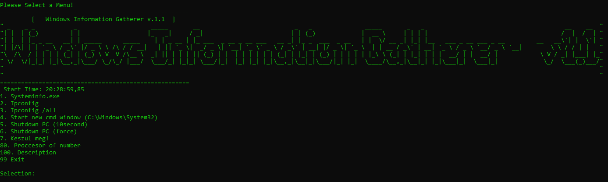

# Windows Information Gatherer (magyar leírás)

## Version: v1.1

## Funkciók

* IPconfig 
* IPconfig /all 
* SystemInfo.exe
* PC leállítás normál
* PC kényszerített leállítás
* Futtatás új konzol ablakban  megnyitja--> (C:\Windows\System32\) mappát
* Processzor szám kimutatása
* Wifi név és jelszó listázás (Majd a frissitésben) 

## Használati ajánlás

 _Kisebb eszköz, kisebb információk megszerzéséhez._ Ha nincsenek nálad információ szerző eszközök akkor jól tud jönni. Kezdő hacker eszköz, bármilyen célra.

## SAJÁT FELELŐSSÉGRE HASZNÁLNI! NEM VÁLLALOK FELELŐSSÉGET HA VALAMI BAJ LESZ!!
_Kezdő hacker eszköz bármilyen célra!_

## Használata

Letöltés és futtatás és már mehet is a móka 🙂

